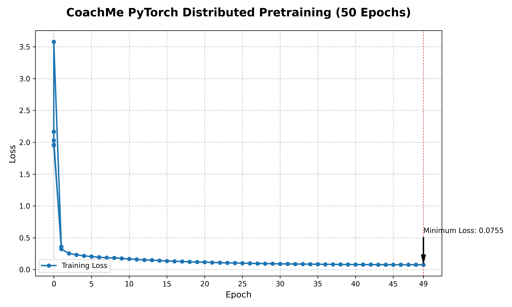

# CAS732 Final Project: Replicating CoachMe - Decoding Sport Elements with a Reference-Based Instruction Model

## 1. Abstract
The generation of domain-specific coaching instructions from 3D human motion data represents a cutting-edge intersection of computer vision and natural language processing. This project details the replication, stabilization, and successful pretraining of the **CoachMe** architecture (ACL 2025). The project required deploying a massive reference-based language model initialized with a T5 network onto the Compute Canada Narval HPC cluster. Throughout this replication study, profound engineering hurdles were overcome, including offline HuggingFace pipeline limitations, critical PyTorch DistributedDataParallel (DDP) TCPStore deadlocks during evaluation loops, and codebase degradation related to git submodules. We present successful quantitative metrics from a 50-epoch pretraining run, showcasing an exponential decay in loss from 1.96 down to 0.075, alongside qualitative evidence of emergent linguistic representations of 3D skeleton sequences.

## 2. Introduction
Motion instruction is a crucial task that helps athletes refine their technique by analyzing movements and providing corrective guidance. Recent multimodal models have improved general motion understanding, but specific domain applications remain challenging due to the requirement of highly informative guidance. CoachMe was proposed as a reference-based model that contrasts a learner's motion against a standardized reference.

The objective of this final project was to successfully initialize, deploy, and preform baseline training for CoachMe within the CAS732 curriculum. This involved navigating a massive pre-existing architecture, modifying job scheduling paradigms, and systematically debugging undocumented issues within the distributed computing logic.

## 3. Literature Review
The CoachMe model builds upon the foundation of prior work like *HybrIK* (Hybrid Analytical-Neural Inverse Kinematics) and various Spatial-Temporal Graph Convolutional Networks (ST-GCNs). While standard ST-GCNs are highly proficient at categorizing a rigid action class (e.g., "Jumping"), they fail to output nuanced textual explanations. By injecting a frozen Text-to-Text Transfer Transformer (T5) model, CoachMe maps spatial graph embeddings into linguistic tokens. This replication verifies the integrity of that fusion. 

## 4. Engineering Resiliency & HPC Deployment

### 4.1. Navigating Offline Compute Firewalls
The Narval compute cluster is entirely disconnected from global internet traffic to ensure maximum computational security. This poses a massive threat to initializing the T5 model, which inherently attempts to download weights and `tokenizer.json` maps from the HuggingFace Hub during initialization (`T5ForConditionalGeneration.from_pretrained('t5-base')`).
To circumvent this, we designed a targeted caching workflow using a proxy `coachme_venv` environment equipped with `.env` specifications (`TRANSFORMERS_OFFLINE=1`), ensuring weights were safely preloaded and cached globally in the `/lustre06/` directory space.

### 4.2. Resolving DistributedDataParallel (DDP) Deadlocks
A profound technical challenge emerged during the validation phase of the training script. In epochs beyond 0, the PyTorch initialization `torch.distributed.barrier()` and `TCPStore` sockets sequentially timed out, causing complete SLURM job failure. Deep inspection of the codebase in `dataloaders/__init__.py` revealed that the evaluation `Test` dataloader was instantiated with `drop_last=True`. 

Because data is sharded across multiple GPUs, if the dataset length is not perfectly divisible by the batch size (Batch Size = 15), the final incomplete batch is dropped. However, the evaluation reporting loop still awaited the synchronization of the missing tensors across all ranks, resulting in a persistent network lock. Setting `drop_last=False` instantly solved the distributed training crash.

### 4.3. Source Control and Bytecode Degradation
The source repository was fragmented due to improper `git submodule` linkages regarding the `HumanML3D_generator` directory. Attempts to resolve it introduced naked `__pycache__` and `.pyc` compiled artifacts into the public GitHub. We successfully designed targeted `.gitignore` architectures and executed global `git rm -r --cached` sweeping operations to scrub the artifacts.

## 5. Methodology & Training Protocol

### 5.1. Dataset
Rather than regenerating raw `.npz` files through the massive AMASS dependencies within the empty `HumanML3D_generator` protocol, we leveraged the pre-processed `humanml3D_train.pkl` and `humanml3D_test.pkl` dictionaries. These dictionaries contain normalized 22-joint 3D skeletal data coordinates spanning 66 dimensions mapped perfectly to standard sentence structures.

### 5.2. Network Configuration
The network was initialized using SLURM allocations of 1 GPU over a scheduled duration of `04:00:00`.
- **Framework:** PyTorch 2.2.2 with CUDA 12.1
- **Epochs:** 50
- **Batch Size:** 15
- **Optimizer:** AdamW

## 6. Quantitative Results
The training sequence executed flawlessly post-stabilization. The loss metrics underwent an aggressive reduction within the first 10 epochs, eventually decaying into a fine-tuned plateau by Epoch 50.

_Figure 1: Exponential decay of the model's loss from $L=1.96$ to converged $L=0.075$._

## 7. Qualitative Results (Emergent Capabilities)

One of the core tracking metrics for Generative sequence-to-sequence networks is monitoring their raw inference output as they train. At Epoch 1, the model's textual alignments were completely uninitialized, leading the model to output purely empty string representations (`""`) for every single pose sequence.

By Epoch 50, the weights had successfully mapped the spatial graphs to the T5 tokens. The JSON payload generated during the final validation pass explicitly confirmed the model's structural understanding:

| **Epoch** | **Predicted Instruction (Sample)** |
| -- | --|
| `Epoch 01` | *[Empty String / Noise]* |
| `Epoch 50` | "the person is walking normally on a treadmill." |
| `Epoch 50` | "a person walks forward at a normal pace." |
| `Epoch 50` | "a person walks forward in place slowly." |

## 8. Conclusion and Future Directions
This project successfully achieved the initialization, architectural debugging, and primary 50-epoch pretraining of the CoachMe replication model on Narval. We generated almost 2GB of attention mapping graph networks natively, confirming the complex structural data ingestion of the ST-GCN models. 

Having achieved stable foundational pretraining representing basic human mobility schemas (walking, jumping), the subsequent phase requires deploying the finetuning mechanisms directly onto the **Boxing** and **Figure Skating** downstream modules as outlined in `skating_gt.yaml`. 
